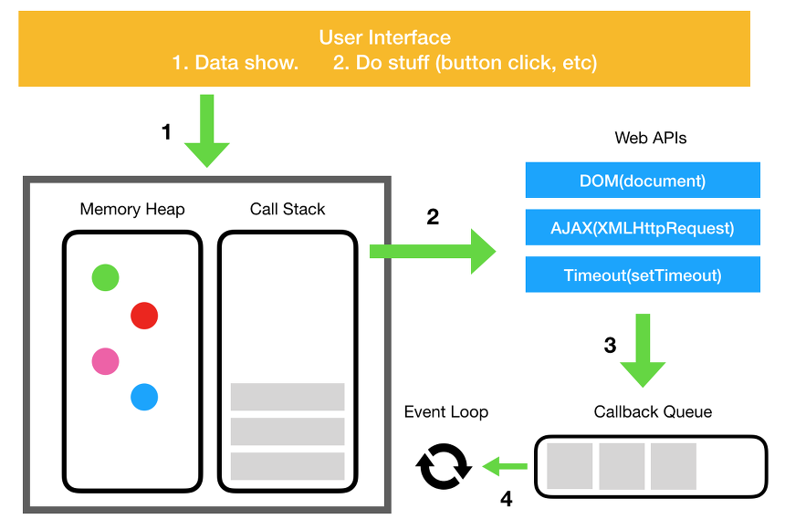

# 메모리 구조
## 자바스크립트 엔진
- 파싱과 JIT 컴파일 머신을 제공
ex) 구글의 V8 

### 구성
1. 메모리 힙 (Memory Heap) 
    - 대부분 구조화되지 않은 메모리 영역에 할당된다.
    - 변수와 객체들의 모든 메모리 할당이 여기서 발생한다.
2. 호출 스택 (Call Stack)    
    - 코드 실행에 따라 호출 스택이 쌓이는 곳

## 실행 환경 (Runtime)

- 프로그램에서 실행하는 동안 사용 가능한 내장 라이브러리를 제공하는 환경
- runtime과 engine 관계는 전통적인 링커와 컴파일러의 관계

## 호출 스택 (Call Stack)
- 자바스크립트는 기본적으로 싱글 쓰레드 기반 언어
- 자료 구조 : 스택 > LIFO 구조
    + 호출 함수를 call stack에 push / pop
- 스택 프레임 (Stack Frame) : 호출 스택의 각 단계
    + 스택 트레이스 (Stack Trace)
    + 스택 오버플로우 (Stack Overflow)
    

## 비동기 콜백 (Asynchronous Callback)
- 하나의 호출 스택만 있기 때문에 가장 쉬운 해결책으로 비동기 콜백을 사용한다.
- 바로 호출 스택에 push 되지 않는다. 
- response에서 호출자 분리는 자바스크립트 런타임이 비동기 명령이 완료되고 콜백이 호출될 때까지 기다리는 동안 다른 일을 하는 것을 허용
- DOM 이벤트, Http 요청, Timer 함수 등 비동기 이벤트들을 다루기 위한 코드들은 브라우저 내부 C++로 구현된 코드들에 의해 만들어진 기본적인 스레드들의 API를 호출한다.
    + Web API


## 이벤트 루프 (Event Loop) & 콜백 큐(Callback Queue)
- 자바스크립트 실행환경은 이벤트 루프와 Callback Queue를 가지고 있다.
- Event Loop : Call Stack 내에서 현재 실행 중인 task 가 있는지, 그리고 Event Queue에 task 확인을 반복한다. Call Stack이 비어있다면 Callback Queue 내의 task 가 Call Stack으로 이동하고 실행된다.
- Callback Queue : 비동기 처리 함수의 콜백 함수, 비동기식 이벤트 핸들러, timer 함수의 콜백 함수가 보관되는 영역으로 Event Loop에 의해 특정 시점에 순차적으로 Call Stack 으로 이동되어 실행된다.

### 이벤트 큐의 처리 과정

```javascript
setTimeout(() => { console.log('hi') }, 1000);
```
1) setTimeout 함수를 call stack 에 push
2) setTimeout으로 호출된 Web API는 요청한 시간동안 대기
    - DOM 이
3) call stack 에서 pop
4) Web API의 timeout이 만료되면 Web API는 이벤트 루프에 코드 추가
    - 이벤트 루프는 호출 스택에 이미 실행 중인 코드가 존재할 수 있으므로, 이벤트 루프에 대기 중인 function을 call stack에 바로 push 하지 않음
    - 이벤트 루프의 자료 구조 : 큐 > FIFO 구조
5) 호출 스택이 비게 될 때 Callback Queue에서 대기 중인 항목을 call stack으로 push하여 함수 실행 
    - callback queue : pop
    - call stack : push
6) 호출 스택에서 해당 함수가 실행되면 pop
    - call stack : pop
